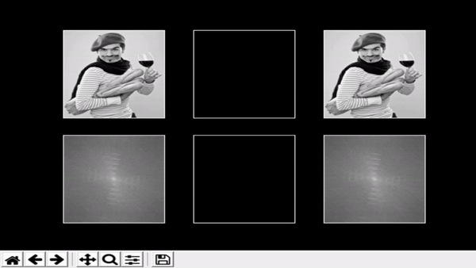
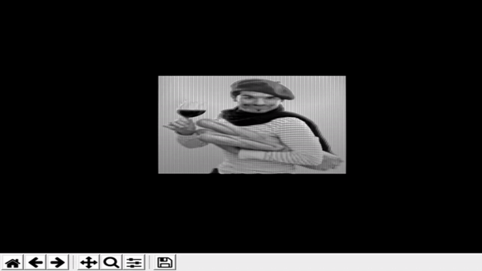
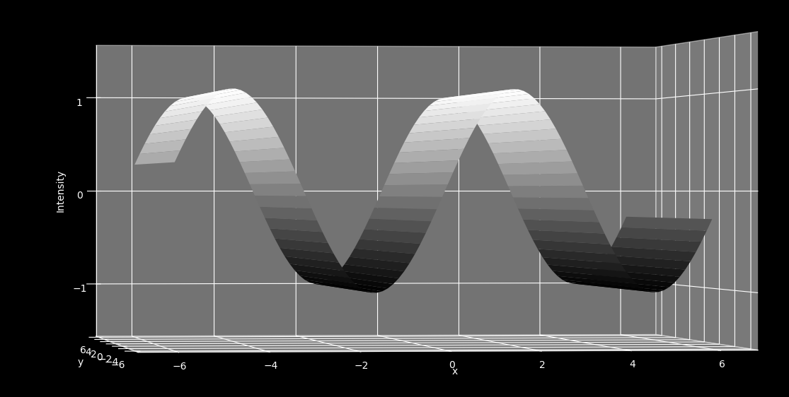
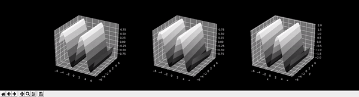

# Fourier Transform Animations

Example outputs of programs shown below

## filter_demo.py

Shows the resulting images of the frequency domain that is undergoing a growing high and low pass threshold. This is
supposed to demonstrate how low frequencies give the image its general shape, high frequencies give the image its sharpness,
and that the low pass image and the original image will look the same way before the threshold grows completely.

## 3d_image.py

The grayscale image was plotted on a 3d surface to show that an image can be considered a 3D wave, so the fourier transform
can be used on it. Whiter values are a higher amplitude and darker values are a lower amplitude.

## sinusoidal.py

Literally just a sinusoid

## sinusoidal_addition_3d.py

Just two sinusoidal functions being added.